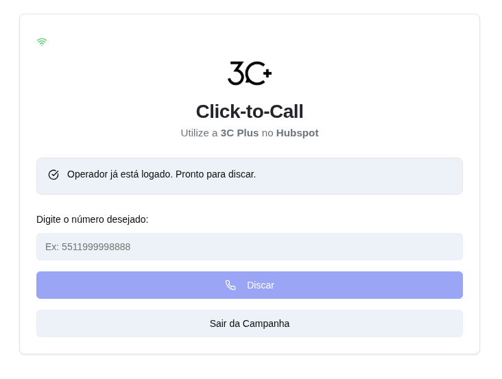

# 🎯 Click-to-Call 3C Plus + HubSpot

Sistema de integração entre a plataforma de telefonia **3C Plus** e o CRM **HubSpot**, permitindo realizar e gerenciar chamadas telefônicas diretamente pela interface do HubSpot.

<div align="center">
  
</div>

## 📋 Sobre o Projeto

Este projeto implementa uma extensão de chamadas para o HubSpot CRM que utiliza a infraestrutura de telefonia da 3C Plus. O sistema permite:

- ✅ Autenticação de operadores via token
- ✅ Seleção e login em campanhas ativas
- ✅ Realização de chamadas telefônicas
- ✅ Qualificação de chamadas em tempo real
- ✅ Registro automático de chamadas no HubSpot
- ✅ Gravação de chamadas com links automáticos
- ✅ Sincronização em tempo real via WebSocket

## 🛠️ Tecnologias Utilizadas

### Core
- **[Next.js](https://nextjs.org/) 15.2.4** - Framework React com App Router
- **[React](https://react.dev/) 19** - Biblioteca para interfaces de usuário
- **[TypeScript](https://www.typescriptlang.org/) 5** - Superset JavaScript com tipagem estática

### UI/UX
- **[Tailwind CSS](https://tailwindcss.com/) 3.4.17** - Framework CSS utilitário
- **[Radix UI](https://www.radix-ui.com/)** - Componentes acessíveis e não-estilizados
- **[shadcn/ui](https://ui.shadcn.com/)** - Biblioteca de componentes reutilizáveis
- **[Lucide React](https://lucide.dev/)** - Ícones

### Comunicação & Integrações
- **[Socket.IO Client](https://socket.io/)** - WebSocket para comunicação em tempo real
- **[@hubspot/calling-extensions-sdk](https://www.npmjs.com/package/@hubspot/calling-extensions-sdk)** - SDK oficial do HubSpot para extensões de chamadas
- **[React Hook Form](https://react-hook-form.com/)** - Gerenciamento de formulários
- **[Zod](https://zod.dev/)** - Validação de schemas

### Ferramentas de Desenvolvimento
- **[ESLint](https://eslint.org/)** - Linter JavaScript/TypeScript
- **[PostCSS](https://postcss.org/)** - Processador CSS
- **[Autoprefixer](https://autoprefixer.github.io/)** - Prefixos CSS automáticos

## 🚀 Como Rodar o Projeto

### Pré-requisitos

- **Node.js** 18+ instalado ([Download](https://nodejs.org/))
- **npm** ou **pnpm** (gerenciador de pacotes)
- **Token de Operador** da 3C Plus
- Conta no **HubSpot** (para integração completa)

### Instalação

1. **Clone o repositório**:
    ```bash
    git clone git@github.com:wosiak/clicktocall-3cplus-hubspot-v2.git
    ```

2. **Instale as dependências**:
    ```bash
    # Usando npm
    npm install

    # OU usando pnpm (se instalado)
    pnpm install
    ```

### Executar em Desenvolvimento

```bash
# Usando npm
npm run dev

# OU usando pnpm
pnpm dev
```

O aplicativo estará disponível em: **http://localhost:3000**

### Build para Produção

```bash
# Criar build otimizado
npm run build

# Executar build de produção
npm run start
```

### Linting

```bash
npm run lint
```

## 📁 Estrutura do Projeto

```
clicktocall-3cplus-hubspot-v2/
│
├── app/                          # Next.js App Router
│   ├── page.tsx                 # Página principal
│   ├── layout.tsx               # Layout raiz
│   └── globals.css              # Estilos globais
│
├── components/                   # Componentes React
│   ├── click-to-call-system.tsx # Componente principal do sistema
│   ├── theme-provider.tsx       # Provedor de temas
│   └── ui/                      # Componentes UI (shadcn/ui)
│       ├── button.tsx
│       ├── card.tsx
│       ├── input.tsx
│       └── ...                  # Outros componentes
│
├── hooks/                        # React Hooks customizados
│   ├── use-call-socket.ts       # Hook para gerenciar WebSocket
│   └── use-toast.ts             # Hook para notificações
│
├── lib/                          # Bibliotecas e utilitários
│   ├── hubspot-call-provider.ts # Integração com HubSpot SDK
│   └── utils.ts                 # Funções utilitárias
│
├── public/                       # Arquivos estáticos
├── styles/                       # Estilos adicionais
├── components.json              # Configuração shadcn/ui
├── next.config.mjs              # Configuração Next.js
├── package.json                 # Dependências do projeto
├── tailwind.config.ts           # Configuração Tailwind
└── tsconfig.json                # Configuração TypeScript
```

## 🔧 Como Usar

### 1. Obter Token da 3C Plus

- Acesse sua conta na plataforma [3C Plus](https://app.3c.plus/)
- Navegue até as configurações de API
- Copie seu **Token de Operador**

### 2. Conectar ao Sistema

1. Abra o aplicativo em **http://localhost:3000**
2. Cole o **Token de Operador** no campo correspondente
3. Clique em **"Conectar"**
4. Permita popups quando solicitado (necessário para a extensão)
5. Permita acesso ao microfone quando solicitado

### 3. Fazer uma Chamada

1. Selecione uma **campanha** da lista disponível
2. Aguarde o login ser concluído
3. Insira o número de telefone no formato: `5511999998888`
4. Clique em **"Discar"**
5. Aguarde a conexão da chamada

### 4. Qualificar uma Chamada

- Após a chamada ser atendida ou finalizada
- Selecione uma **qualificação** da lista disponível
- Os dados serão automaticamente sincronizados com o HubSpot

## 🔌 Integração com HubSpot

### Configurar no HubSpot

Para usar o sistema dentro do HubSpot CRM:

1. Acesse **Configurações** no HubSpot
2. Navegue até **Integrações** > **Extensões de Chamadas**
3. Adicione uma nova extensão customizada
4. Configure a URL:
   - Desenvolvimento: `http://localhost:3000`
   - Produção: `https://seu-dominio.com`
5. Salve e ative a extensão

### Funcionalidades no HubSpot

- **Click-to-Call**: Clique em números de telefone no HubSpot para discar automaticamente
- **Registro Automático**: Chamadas são registradas automaticamente como atividades
- **Gravações**: Links de gravação são incluídos nos registros
- **Qualificações**: Resultados das chamadas são salvos como propriedades

## 🌐 APIs Utilizadas

### 3C Plus API

Base URL: `https://app.3c.plus/api/v1/`

- `GET /groups-and-campaigns` - Listar campanhas disponíveis
- `POST /agent/connect` - Conectar operador
- `POST /agent/login` - Login em campanha
- `POST /agent/logout` - Logout
- `POST /agent/manual_call/dial` - Iniciar chamada
- `POST /agent/call/{id}/hangup` - Encerrar chamada
- `POST /agent/manual_call/{id}/qualify` - Qualificar chamada

### WebSocket 3C Plus

URL: `wss://socket.3c.plus`

**Eventos em tempo real:**
- `connected` - Conexão estabelecida
- `agent-is-connected` - Status do agente
- `call-was-connected` - Chamada conectada
- `manual-call-was-answered` - Chamada atendida
- `manual-call-was-qualified` - Chamada qualificada
- `call-was-finished` - Chamada finalizada
- `call-was-not-answered` - Chamada não atendida
- `call-was-failed` - Chamada falhou
- `call-history-was-created` - Histórico criado (com link de gravação)

## 🐛 Troubleshooting

### Popup Bloqueado
Se a extensão não abrir, verifique se o navegador está bloqueando popups e permita para o site.

### Erro de Conexão
- Verifique se o token está correto
- Confirme se há conexão com a internet
- Verifique se o microfone está funcionando

### Chamada Não Inicia
- Certifique-se de que está logado em uma campanha
- Verifique o formato do número: `5511999998888` (sem espaços ou caracteres especiais)

### Gravação Não Aparece
- As gravações podem levar alguns segundos para serem processadas
- O sistema aguarda automaticamente até 10 segundos pela gravação

## 🔄 Fluxo de Funcionamento

1. **Conexão**: Usuário insere token → conecta via WebSocket à 3C Plus
2. **Login**: Seleciona campanha → extensão abre em nova aba
3. **Discagem**: Insere número ou recebe do HubSpot → inicia chamada
4. **Durante Chamada**: Monitora eventos (conectada, atendida, finalizada)
5. **Qualificação**: Seleciona resultado da chamada
6. **Registro**: Envia dados completos (incluindo gravação) para o HubSpot

## 📝 Licença

Este projeto é proprietário da 3C Plus.

## 👥 Contribuição

Para contribuir com o projeto, entre em contato com a equipe de desenvolvimento da 3C Plus.

## 📞 Suporte

Para suporte técnico:
- **3C Plus**: [https://3cplusnow.com/](https://3cplusnow.com/)
- **HubSpot**: [https://developers.hubspot.com/](https://developers.hubspot.com/)

---

**Desenvolvido com ❤️**
